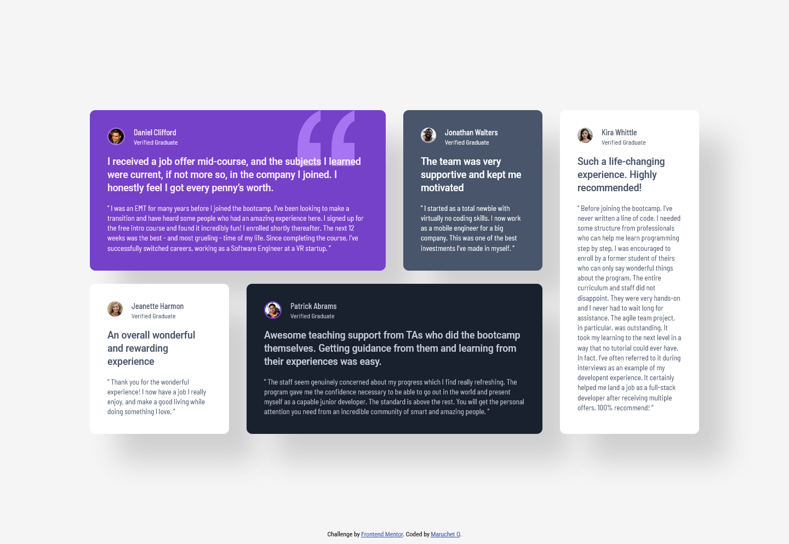

# Frontend Mentor - Testimonials grid section solution

This is a solution to the [Testimonials grid section challenge on Frontend Mentor](https://www.frontendmentor.io/challenges/testimonials-grid-section-Nnw6J7Un7). Frontend Mentor challenges help you improve your coding skills by building realistic projects. 

## Table of contents

- [Overview](#overview)
  - [The challenge](#the-challenge)
  - [Screenshot](#screenshot)
  - [Links](#links)
- [My process](#my-process)
  - [Built with](#built-with)
  - [What I learned](#what-i-learned)
- [Author](#author)

## Overview

### The challenge

Users should be able to:

- View the optimal layout for the site depending on their device's screen size

### Screenshot




### Links

- Live Site URL: [Add live site URL here](https://your-live-site-url.com)

## My process

### Built with

- Semantic HTML5 markup
- CSS custom properties
- Flexbox
- CSS Grid
- Mobile-first workflow

### What I learned

```css
.container {
  display: grid;
  grid-template-columns: 1fr repeat(4, 254px) 1fr;
  gap: 24px 32px;
  /* column-gap: 32px;
  row-gap: 24px; */
}
.card-1 {
  grid-column: 2 / 4;
  grid-row: 1 / 2;
}

/* https://www.w3schools.com/cssref/pr_background-position.php */
.hero-image {
  background-image: url("./images/bg-pattern-quotation.svg");
  background-repeat: no-repeat;
  background-attachment: fixed;
  background-position: 87% 0%;
}
```

If you want more help with writing markdown, we'd recommend checking out [The Markdown Guide](https://www.markdownguide.org/) to learn more.

## Author

- Frontend Mentor - [@MaruchetO](https://www.frontendmentor.io/profile/MaruchetO)
